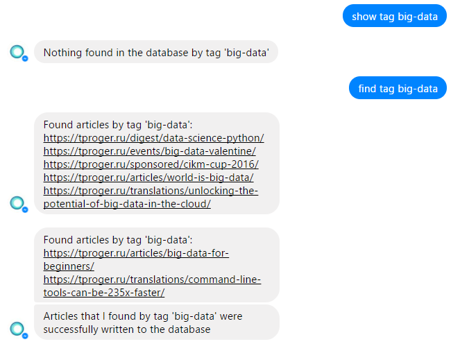
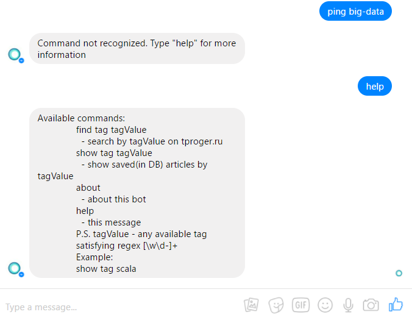

# Scala bot for [tproger](https://tproger.ru)

**Used:**
* Play framework
* Slick framework
* PostgreSQL
* Jsoup library
* Continuous integration with Heroku

DB model: [creation script](/create_db.sql)
 
Working deployed bot: [facebook page](https://www.facebook.com/tprogerResearch)
 
TODO list: [TODO.md](/TODO.md)
 
Currently, the bot is under development, so it only replies to it's developers. Instead, please see screenshots and code. Thanks for understanding.

**Screenshots:**

